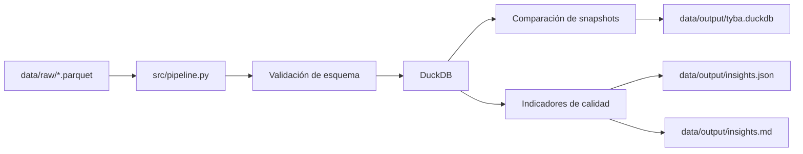

# Arquitectura y funcionamiento del pipeline

## 1. Objetivo

El pipeline procesa cortes periódicos de movimientos financieros en formato Parquet. Para cada corte:

1. valida el esquema de entrada;
2. calcula una identidad técnica del archivo mediante SHA-256;
3. conserva el corte y sus filas en DuckDB;
4. evita duplicar un archivo ya cargado;
5. compara cortes consecutivos;
6. genera indicadores de calidad e insights en JSON y Markdown.

La solución está diseñada para ser reproducible, auditable y conservadora: no modifica los archivos fuente ni corrige silenciosamente los datos.

## 2. Componentes



### Entradas

Los archivos se leen desde `data/raw/`. Cada Parquet debe contener exactamente estas columnas:

- `id_cliente`
- `date`
- `product`
- `type`
- `fund`
- `amount`
- `description`
- `commercial_name`

El pipeline rechaza columnas faltantes o inesperadas. Esto evita que un cambio de contrato pase inadvertido.

### Código principal

[src/pipeline.py](../src/pipeline.py) concentra el flujo completo y expone `run_pipeline(input_dir, output_dir)` para ejecución programática.

### Persistencia

La base [data/output/tyba.duckdb](../data/output/tyba.duckdb) contiene:

- `snapshots`: un registro por archivo cargado, con nombre, hash, cantidad de filas y orden.
- `snapshot_rows`: todas las filas de todos los cortes, junto con sus claves y fechas normalizadas.
- `change_events`: diferencias entre cada par de cortes consecutivos.
- `current_movements`: vista con las filas del último corte según el orden natural de los nombres.

## 3. Flujo paso a paso

### Paso 1: Descubrimiento y ordenamiento

El pipeline busca `*.parquet` y los ordena naturalmente por nombre. Por ejemplo:

```text
movimientos_dia_T.parquet
movimientos_dia_T1.parquet
movimientos_dia_T2.parquet
```

Los nombres deben representar el orden temporal. El pipeline no obtiene la fecha desde el nombre.

### Paso 2: Identificación del archivo

Para cada archivo se calcula un SHA-256 leyendo el contenido por bloques. La combinación de `source_name` y `content_sha256` genera `snapshot_key`.

Esto permite distinguir:

- el mismo archivo cargado otra vez: se omite;
- un archivo con el mismo nombre pero contenido nuevo: se incorpora como otro snapshot;
- dos archivos diferentes: se conservan por separado.

### Paso 3: Validación del esquema

Antes de insertar filas, DuckDB inspecciona el esquema del Parquet. Si faltan columnas obligatorias o aparecen columnas no contempladas, se lanza `ValueError` y la transacción se revierte.

### Paso 4: Normalización de fechas

Se aceptan los formatos observados:

- `YYYY-MM-DD`
- `DD/MM/YYYY`

La columna original se conserva en `source_date` y la fecha interpretada se guarda en `movement_date`. Si una fecha no puede interpretarse, `movement_date` queda en `NULL` y se cuenta como problema de calidad.

### Paso 5: Creación de claves

Como los archivos entregados no tienen el `id` de transacción descrito en el PDF, se construyen dos hashes:

- `movement_key`: `id_cliente`, fecha normalizada o texto original, `product`, `fund` y `commercial_name`.
- `record_hash`: los campos anteriores más `type`, `amount` y `description`.

La clave candidata permite comparar registros sin afirmar que representa una identidad transaccional real.

### Paso 6: Carga transaccional

La carga de todos los archivos se ejecuta dentro de una transacción DuckDB. Al finalizar se recalcula el orden de snapshots, se reconstruyen los eventos y se crea la vista actual. Ante un error se hace `ROLLBACK`.

### Paso 7: Clasificación de cambios

Para cada par consecutivo se agrupan las filas por `movement_key` y se aplican estas reglas:

| Condición | Evento |
| --- | --- |
| La clave aparece una vez en ambos cortes y el hash no cambia | `UNCHANGED` |
| La clave aparece una vez en ambos cortes y el hash cambia | `CORRECTED` |
| La clave solo aparece en el corte nuevo | `NEW` |
| La clave solo aparece en el corte anterior | `REMOVED` |
| La clave aparece más de una vez en cualquiera de los cortes | `AMBIGUOUS` |

En el último caso no se fuerza una correspondencia entre filas.

### Paso 8: Generación de insights

El pipeline calcula, sobre el snapshot actual:

- cantidad de filas;
- clientes distintos;
- suma de montos no nulos;
- nulos por columna;
- fechas no interpretables y formatos observados;
- montos negativos y en cero;
- totales por tipo normalizado (`IN`/`OUT`);
- cambios entre snapshots.

Los resultados se escriben en [data/output/insights.json](../data/output/insights.json) y [data/output/insights.md](../data/output/insights.md).

## 4. Decisiones de calidad y trazabilidad

- Los Parquet originales se montan como solo lectura en Docker.
- No se eliminan filas por tener nulos.
- No se corrigen montos negativos, ceros o signos según el tipo.
- Los valores fuente se conservan, incluso cuando se crea una versión normalizada para análisis.
- Cada corte permanece almacenado para permitir auditoría y comparación histórica.
- La carga es idempotente para archivos con el mismo nombre y contenido.
- Las operaciones de persistencia se ejecutan en una transacción.

## 5. Limitación de identidad

La solución no puede identificar de manera fiable una transacción individual porque el origen proporciona `id_cliente`, que se repite, en lugar de un identificador de transacción estable.

Por eso, `movement_key` es una clave compuesta candidata. Sus consecuencias son:

- una corrección en un campo incluido en la clave puede aparecer como `REMOVED` + `NEW`;
- claves duplicadas se clasifican como `AMBIGUOUS`;
- los cambios de `type`, `amount` o `description` se detectan como `CORRECTED` solo cuando la clave es única en ambos cortes.

Para resolver esta limitación en producción se necesita incorporar al contrato de datos un identificador estable de transacción.

## 6. Estructura del proyecto

```text
.
├── data/
│   ├── raw/                  # Parquet de entrada, sin modificar
│   └── output/               # DuckDB e insights generados
├── docs/                     # Documentación técnica y operativa
├── src/pipeline.py           # Implementación del pipeline
├── test/test_pipeline.py     # Pruebas automatizadas
├── Dockerfile                # Imagen reproducible
├── docker-compose.yml        # Ejecución con volúmenes
└── requirements.txt          # Dependencia de ejecución
```
